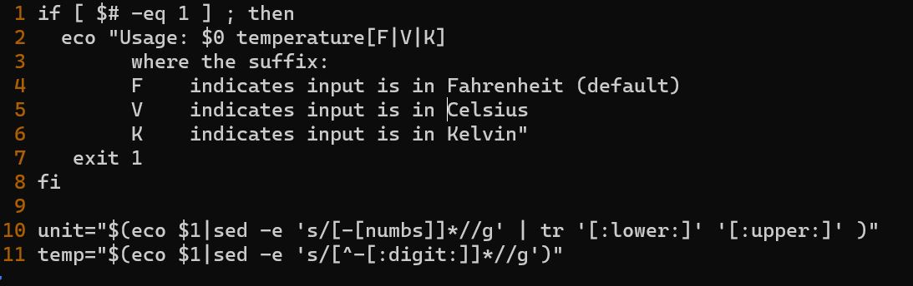
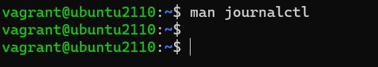
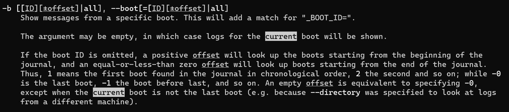
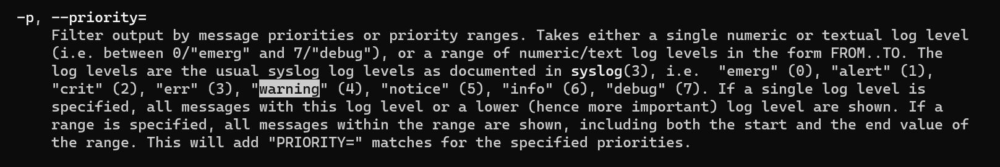
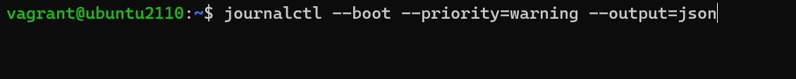
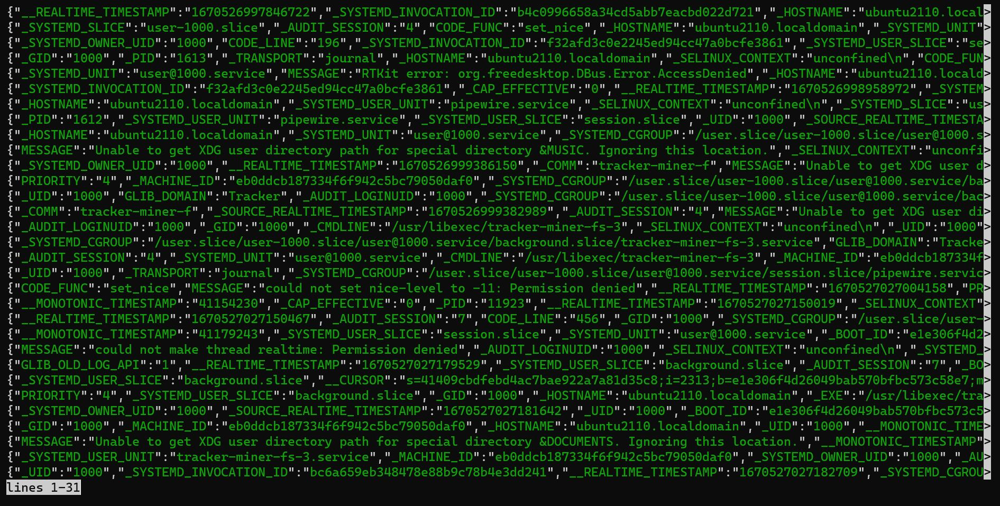
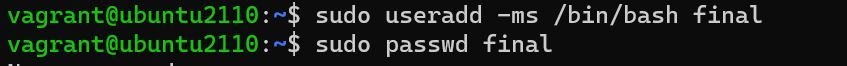
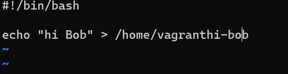
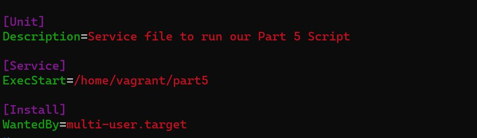
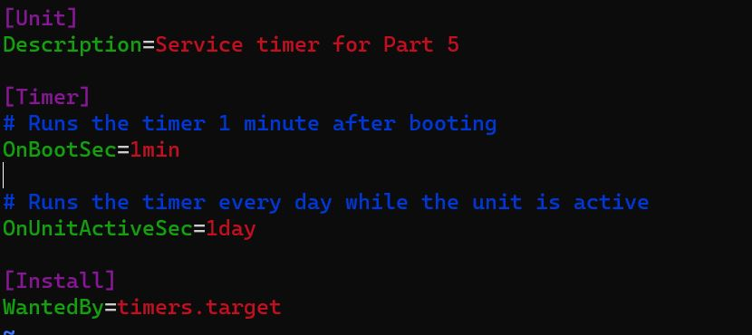

# Exam_2420

Part 1
-----------

```
sudo apt update
sudo apt upgrade
```

Part 2
----------


**Note:** Number lines were showed using `:set number` in Normal Mode

`-eq 1` was changed to `-eq 0` by  using the command in Normal Mode `:%s/1/0/gci` and selcing `y` for the first occurence and `n` for the second

`temperature[F|V|K]` was changed to `temperature[F|C|K]` by using the command in Normal Mode `:2s/V/C/gci` with 2 representing the number line

` V    indicates input is in Celsius` was changed to ` C    indicates input is in Celsius` by using the command in Normal Mode `:5s/V/C/gci` with 5 representing the number line

`:digit:` was changed to `numbs` by using the command in Normal Mode `:10s/:digit:/numbs/gci` with 10 representing the number line

Part 3
------



Once in the man page for journalctl, I used the `/` to search for keywords to find the correct options




I used `/current` to search for the current boot and found the `-b` or `--boot` option




I used `warning` to search for the warning keyword and found the `-p` or `--priority` option


I used the `output` keyword and found the `-o` or `--output` option and scrolled down to find the `json` output


Here is a photo of the command





Here are the sreenshots of using the command and its output

The final command used `journalctl --boot --priority=warning --output=json`


Part 4
------



**Did not complete this Part**


Part 5
------





This file is in the directory `/etc/systemd/system`

```


```


Part 6
-------



This file is in the directory `/etc/systemd/system`
